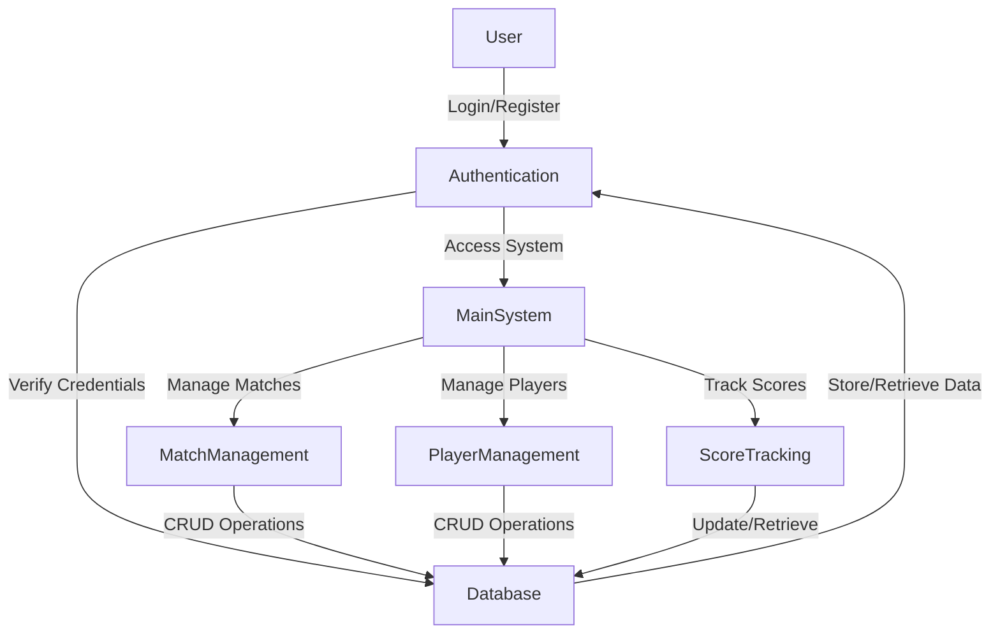
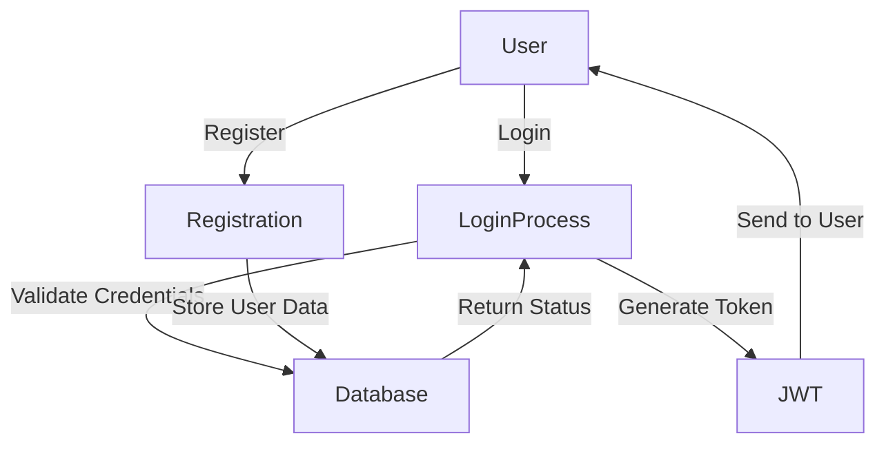

# ScoreBoardX - Sports Management System Project Report

## 1. Project Overview

### 1.1 Project Description
ScoreBoardX is a comprehensive sports management system designed to streamline the process of managing sports matches, players, and match statistics. The system provides real-time score updates, player management, and comprehensive match tracking capabilities.

### 1.2 Objectives
- Provide a user-friendly interface for managing sports matches
- Enable real-time score updates and tracking
- Maintain comprehensive player statistics
- Implement secure user authentication and authorization
- Ensure data integrity and reliability

## 2. System Architecture

### 2.1 Data Flow Diagrams

#### 2.1.1 Level 0 DFD


#### 2.1.2 Level 1 DFD - User Authentication


## 3. Technical Implementation

### 3.1 Frontend Architecture
- Built using Node.js with Express framework
- Uses Express version 5.1.0
- Modern UI with responsive design
- Real-time score updates using WebSocket
- Client-side validation and form handling

### 3.2 Backend Architecture
- Built using PHP
- RESTful API architecture
- JWT-based authentication
- PDO for database operations
- Middleware for request validation

### 3.3 Database Design
- Relational Database Management System (MySQL)
- Tables:
  - Users (user management)
  - Matches (match details)
  - Players (player information)
  - Scores (match statistics)
  - MatchStatistics (detailed match stats)

## 4. Key Features

### 4.1 User Management
- Secure user registration and login
- Role-based access control
- Profile management
- Password reset functionality

### 4.2 Match Management
- Create and schedule matches
- Manage match status
- Track match progress
- Record match statistics

### 4.3 Player Management
- Register and manage players
- Set playing 11
- Track player statistics
- Manage player roles

### 4.4 Score Tracking
- Real-time score updates
- Record runs, wickets, and extras
- Manage bowling changes
- Track player performance

## 5. Code Implementation

### 5.1 Authentication System (Backend)
```php
// SportsApp/api/Login.php
<?php
require_once '../config/Database.php';
require_once '../middlewares/JWT.php';

header('Content-Type: application/json');

$database = new Database();
$db = $database->getConnection();

$data = json_decode(file_get_contents("php://input"));

if (!isset($data->email) || !isset($data->password)) {
    echo json_encode([
        "message" => "Email and password are required",
        "success" => false
    ]);
    exit;
}

// Query to check user credentials
$query = "SELECT * FROM users WHERE email = :email";
$stmt = $db->prepare($query);
$stmt->bindParam(":email", $data->email);
$stmt->execute();

if ($stmt->rowCount() > 0) {
    $user = $stmt->fetch(PDO::FETCH_ASSOC);
    
    if (password_verify($data->password, $user['password'])) {
        $jwt = new JWT();
        $token = $jwt->generateToken($user['id']);
        
        echo json_encode([
            "message" => "Login successful",
            "success" => true,
            "token" => $token,
            "user" => [
                "id" => $user['id'],
                "name" => $user['name'],
                "email" => $user['email']
            ]
        ]);
    } else {
        echo json_encode([
            "message" => "Invalid credentials",
            "success" => false
        ]);
    }
} else {
    echo json_encode([
        "message" => "User not found",
        "success" => false
    ]);
}
```

### 5.2 Match Creation (Frontend)
```javascript
// Sports APP/public/admin/creatematch.js
async function createMatch(matchData) {
    try {
        const response = await fetch('/api/creatematch', {
            method: 'POST',
            headers: {
                'Content-Type': 'application/json',
                'Authorization': 'Bearer ' + localStorage.getItem('token')
            },
            body: JSON.stringify(matchData)
        });

        const result = await response.json();
        
        if (result.success) {
            alert('Match created successfully!');
            window.location.href = '/admin/managematches';
        } else {
            alert(result.message);
        }
    } catch (error) {
        console.error('Error creating match:', error);
        alert('An error occurred while creating the match');
    }
}
```

## 6. Security Features

### 6.1 Authentication
- JWT-based token authentication
- Password hashing using bcrypt
- Secure session management
- Rate limiting for login attempts

### 6.2 Data Protection
- Input validation and sanitization
- SQL injection prevention
- XSS protection
- CSRF protection

### 6.3 API Security
- Request validation middleware
- Rate limiting for API endpoints
- CORS configuration
- API versioning

## 7. System Requirements

### 7.1 Hardware Requirements
- Minimum 2GB RAM
- Minimum 1GHz processor
- At least 500MB free disk space

### 7.2 Software Requirements
- Node.js (v14 or higher)
- PHP (v7.4 or higher)
- MySQL (v5.7 or higher)
- Composer (PHP package manager)

## 8. Installation Guide

### 8.1 Prerequisites
1. Install Node.js from https://nodejs.org/
2. Install PHP from https://php.net/
3. Install MySQL from https://mysql.com/
4. Install Composer from https://getcomposer.org/

### 8.2 Installation Steps
1. Clone the repository:
   ```bash
   git clone https://github.com/varunjoshi84/ScoreBoardX.git
   cd ScoreBoardX
   ```

2. Set up the database:
   ```bash
   # Create a new MySQL database
   mysql -u root -p
   CREATE DATABASE scoreboard;
   exit;
   
   # Import the database schema
   mysql -u root -p scoreboard < sportsapp.sql
   ```

3. Install frontend dependencies:
   ```bash
   cd "Sports APP"
   npm install
   ```

4. Install backend dependencies:
   ```bash
   cd ../SportsApp
   composer install
   ```

5. Configure environment:
   - Copy `config/Database.php.example` to `config/Database.php`
   - Update database credentials in `config/Database.php`
   - Update API endpoints in the frontend configuration

### 8.3 Running the Application
1. Start the backend server:
   ```bash
   cd SportsApp
   php -S localhost:8000
   ```

2. Start the frontend server:
   ```bash
   cd ../Sports APP
   npm start
   ```

3. Access the application:
   - Frontend: http://localhost:3000
   - Backend API: http://localhost:8000

## 9. Usage Guide

### 9.1 User Registration
1. Visit the registration page
2. Fill in the required information
3. Submit the form
4. Login with your credentials

### 9.2 Creating a Match
1. Login to the system
2. Navigate to the match creation page
3. Fill in match details
4. Add players to the match
5. Set playing 11
6. Start the match

### 9.3 Score Tracking
1. Select the match
2. Start scoring
3. Record runs, wickets, and extras
4. Manage bowling changes
5. Track player statistics

## 10. Project Structure
```
Project Root/
├── Sports APP/           # Frontend
│   ├── node_modules/
│   ├── public/
│   │   ├── admin/
│   │   │   ├── addnewmatch.html
│   │   │   ├── dashboard.html
│   │   │   ├── managematches.html
│   │   │   ├── setplaying11.html
│   │   │   ├── settings.html
│   │   │   ├── updatescores.html
│   │   │   └── users.html
│   │   ├── auth/
│   │   │   ├── login.html
│   │   │   └── register.html
│   │   ├── index.html
│   │   └── scores.html
│   ├── package.json
│   └── server.js
│
└── SportsApp/           # Backend
    ├── api/            # API endpoints
    │   ├── Login.php
    │   ├── Register.php
    │   ├── User.php
    │   ├── creatematch.php
    │   ├── finishinning.php
    │   ├── getbattingplayers.php
    │   ├── getbowlingplayers.php
    │   ├── getcurrentplayers.php
    │   ├── getcurrentscores.php
    │   ├── getmatch.php
    │   ├── getmatchbowlers.php
    │   ├── getmatches.php
    │   ├── getnotoutbatsmen.php
    │   ├── getplaying11.php
    │   ├── getscores.php
    │   ├── gettoss.php
    │   ├── getusers.php
    │   ├── recordwicket.php
    │   ├── setcurrentplayers.php
    │   ├── setplaying11.php
    │   ├── settoss.php
    │   ├── strikechange.php
    │   ├── updatepassword.php
    │   ├── updatescore.php
    │   └── wideball.php
    ├── config/         # Configuration files
    │   └── Database.php
    ├── controllers/    # Controller logic
    │   ├── AuthController.php
    │   └── UserController.php
    ├── middlewares/    # Middleware functions
    │   └── JWT.php
    ├── .htaccess
    └── index.php       # Main entry point
```

## 11. Testing

### 11.1 Unit Testing
- Test individual functions and methods
- Validate input and output
- Check error handling

### 11.2 Integration Testing
- Test API endpoints
- Verify database operations
- Check frontend-backend communication

### 11.3 Performance Testing
- Load testing
- Stress testing
- Response time testing

## 12. Future Updates

### 12.1 Planned Enhancements

#### 12.1.1 Mobile Application
- Develop native mobile apps for iOS and Android
- Implement offline functionality
- Push notifications for match updates
- Mobile-optimized UI/UX

#### 12.1.2 Live Features
- Real-time match streaming
- Live score updates with push notifications
- Live chat for match discussions
- Video highlights integration

#### 12.1.3 Advanced Analytics
- Player performance analytics
- Team performance metrics
- Predictive analytics for match outcomes
- Statistical visualizations
- Historical data analysis

#### 12.1.4 Social Integration
- Social media sharing
- Player profiles with social links
- Match highlights sharing
- Community features
- Leaderboards and rankings

### 12.2 Technical Improvements

#### 12.2.1 Performance Optimization
- Implement caching mechanisms
- Database query optimization
- Code optimization
- Load balancing
- CDN integration for static assets

#### 12.2.2 Security Enhancements
- Two-factor authentication
- Enhanced password policies
- Advanced rate limiting
- Improved session management
- Regular security audits

#### 12.2.3 Scalability Improvements
- Microservices architecture
- Containerization with Docker
- Cloud deployment options
- Auto-scaling capabilities
- Improved database architecture

### 12.3 User Experience Improvements

#### 12.3.1 UI/UX Enhancements
- Dark mode support
- Customizable themes
- Improved responsive design
- Enhanced accessibility
- Better error handling

#### 12.3.2 Additional Features
- Match scheduling system
- Team management tools
- Player recruitment system
- Tournament management
- Fantasy sports integration

### 12.4 Business Intelligence

#### 12.4.1 Analytics Dashboard
- Comprehensive analytics dashboard
- Custom report generation
- Export capabilities
- Data visualization tools
- Performance tracking

#### 12.4.2 Business Tools
- Revenue tracking
- Sponsorship management
- Ticketing system
- Merchandise sales integration
- Marketing tools

### 12.5 Community Features

#### 12.5.1 Social Features
- User profiles
- Follow system
- Match discussions
- User groups
- Community events

#### 12.5.2 Engagement Tools
- Gamification elements
- Achievement system
- User rankings
- Community challenges
- Interactive features

## 13. Conclusion
ScoreBoardX provides a comprehensive solution for managing sports matches and tracking player statistics. The system's modular architecture, secure implementation, and user-friendly interface make it an ideal choice for sports organizations and teams looking to streamline their match management process.

## 14. Acknowledgments
- Thanks to all contributors who have helped improve this project
- Special thanks to the open-source community for their support
- Gratitude to the testing team for their valuable feedback
