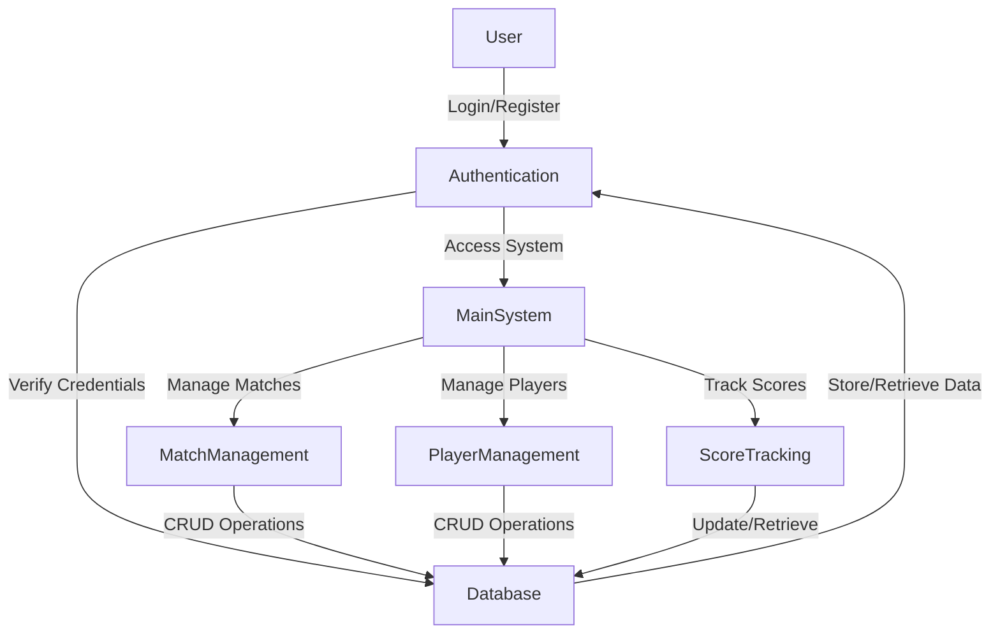
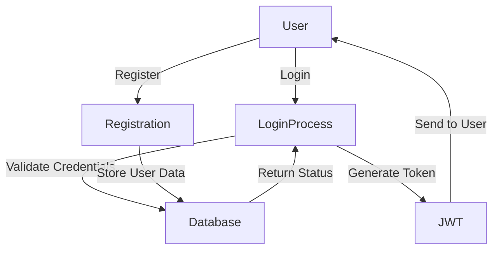

# ScoreBoardX - Sports Management System

A comprehensive sports management system that allows users to create, manage, and track sports matches. The application provides real-time score updates, player management, and match statistics tracking.

## Data Flow Diagram (DFD)

### Level 0 DFD


### Level 1 DFD - User Authentication


## Key Features

### Match Management
- Create new matches with detailed match information
- Manage match scheduling and status
- Track match progress in real-time
- Record match scores and statistics

### Player Management
- Register and manage players
- Set playing 11 for matches
- Track player statistics
- Manage player roles and positions

### Score Tracking
- Real-time score updates
- Track runs, wickets, and overs
- Record extras (wides, no-balls)
- Manage bowling changes

### User Management
- Secure user authentication
- Role-based access control
- User profile management
- Password management

## Technical Stack

### Frontend
- Built using Node.js with Express framework
- Uses Express version 5.1.0
- Contains a `public` directory for static assets
- Includes server.js for handling frontend routing
- Modern UI with responsive design

### Backend
- Built using PHP
- RESTful API architecture
- Key API endpoints:
  - Authentication (login, register)
  - User management
  - Match creation and management
  - Playing 11 selection
  - Score tracking
  - Toss management
  - Player statistics

## Code Examples

### 1. User Authentication (Backend)
```php
// SportsApp/api/Login.php
<?php
require_once '../config/Database.php';
require_once '../middlewares/JWT.php';

header('Content-Type: application/json');

$database = new Database();
$db = $database->getConnection();

$data = json_decode(file_get_contents("php://input"));

if (!isset($data->email) || !isset($data->password)) {
    echo json_encode([
        "message" => "Email and password are required",
        "success" => false
    ]);
    exit;
}

// Query to check user credentials
$query = "SELECT * FROM users WHERE email = :email";
$stmt = $db->prepare($query);
$stmt->bindParam(":email", $data->email);
$stmt->execute();

if ($stmt->rowCount() > 0) {
    $user = $stmt->fetch(PDO::FETCH_ASSOC);
    
    if (password_verify($data->password, $user['password'])) {
        $jwt = new JWT();
        $token = $jwt->generateToken($user['id']);
        
        echo json_encode([
            "message" => "Login successful",
            "success" => true,
            "token" => $token,
            "user" => [
                "id" => $user['id'],
                "name" => $user['name'],
                "email" => $user['email']
            ]
        ]);
    } else {
        echo json_encode([
            "message" => "Invalid credentials",
            "success" => false
        ]);
    }
} else {
    echo json_encode([
        "message" => "User not found",
        "success" => false
    ]);
}
```

### 2. Match Creation (Frontend)
```javascript
// Sports APP/public/admin/creatematch.js
async function createMatch(matchData) {
    try {
        const response = await fetch('/api/creatematch', {
            method: 'POST',
            headers: {
                'Content-Type': 'application/json',
                'Authorization': 'Bearer ' + localStorage.getItem('token')
            },
            body: JSON.stringify(matchData)
        });

        const result = await response.json();
        
        if (result.success) {
            alert('Match created successfully!');
            window.location.href = '/admin/managematches';
        } else {
            alert(result.message);
        }
    } catch (error) {
        console.error('Error creating match:', error);
        alert('An error occurred while creating the match');
    }
}
```

### 3. Score Update (Backend)
```php
// SportsApp/api/updatescore.php
<?php
require_once '../config/Database.php';
require_once '../middlewares/JWT.php';

header('Content-Type: application/json');

$database = new Database();
$db = $database->getConnection();

$data = json_decode(file_get_contents("php://input"));

if (!isset($data->match_id) || !isset($data->score) || !isset($data->overs)) {
    echo json_encode([
        "message" => "Match ID, score, and overs are required",
        "success" => false
    ]);
    exit;
}

try {
    $query = "UPDATE matches SET score = :score, overs = :overs WHERE id = :match_id";
    $stmt = $db->prepare($query);
    
    $stmt->bindParam(":match_id", $data->match_id);
    $stmt->bindParam(":score", $data->score);
    $stmt->bindParam(":overs", $data->overs);
    
    if ($stmt->execute()) {
        echo json_encode([
            "message" => "Score updated successfully",
            "success" => true
        ]);
    } else {
        echo json_encode([
            "message" => "Failed to update score",
            "success" => false
        ]);
    }
} catch (PDOException $e) {
    echo json_encode([
        "message" => "Database error: " . $e->getMessage(),
        "success" => false
    ]);
}
```

## Database Structure
- Uses SQL database (sportsapp.sql)
- Contains tables for:
  - Users
  - Matches
  - Players
  - Scores
  - Match statistics

## Installation and Setup

### Prerequisites
- Node.js (v14 or higher)
- PHP (v7.4 or higher)
- MySQL (v5.7 or higher)
- Composer (PHP package manager)

### Installation Steps

1. Clone the repository:
   ```bash
   git clone https://github.com/varunjoshi84/ScoreBoardX.git
   cd ScoreBoardX
   ```

2. Set up the database:
   ```bash
   # Create a new MySQL database
   mysql -u root -p
   CREATE DATABASE scoreboard;
   exit;
   
   # Import the database schema
   mysql -u root -p scoreboard < sportsapp.sql
   ```

3. Install frontend dependencies:
   ```bash
   cd "Sports APP"
   npm install
   ```

4. Install backend dependencies:
   ```bash
   cd ../SportsApp
   composer install
   ```

5. Configure environment:
   - Copy `config/Database.php.example` to `config/Database.php`
   - Update database credentials in `config/Database.php`
   - Update API endpoints in the frontend configuration

### Running the Application

1. Start the backend server:
   ```bash
   cd SportsApp
   php -S localhost:8000
   ```

2. Start the frontend server:
   ```bash
   cd ../Sports APP
   npm start
   ```

3. Access the application:
   - Frontend: http://localhost:3000
   - Backend API: http://localhost:8000

## Usage

1. Register a new account or login with existing credentials
2. Create a new match by providing match details
3. Add players to the match
4. Set playing 11 for both teams
5. Start the match and begin scoring
   - Record runs, wickets, and extras
   - Manage bowling changes
   - Track player statistics
6. View match statistics and player performance

## Security Features
- Authentication system with JWT tokens
- API endpoints protected with middleware
- Secure password management with hashing
- Input validation and sanitization

## Contributing
Please read CONTRIBUTING.md for details on our code of conduct and the process for submitting pull requests.

## License
This project is licensed under the ISC License - see the LICENSE file for details.

## Support
For support, please open an issue on the GitHub repository or contact the maintainers directly.

## Project Structure
```
Project Root/
├── Sports APP/           # Frontend
│   ├── node_modules/
│   ├── public/
│   │   ├── admin/
│   │   │   ├── addnewmatch.html
│   │   │   ├── dashboard.html
│   │   │   ├── managematches.html
│   │   │   ├── setplaying11.html
│   │   │   ├── settings.html
│   │   │   ├── updatescores.html
│   │   │   └── users.html
│   │   ├── auth/
│   │   │   ├── login.html
│   │   │   └── register.html
│   │   ├── index.html
│   │   └── scores.html
│   ├── package.json
│   └── server.js
│
└── SportsApp/           # Backend
    ├── api/            # API endpoints
    │   ├── Login.php
    │   ├── Register.php
    │   ├── User.php
    │   ├── creatematch.php
    │   ├── finishinning.php
    │   ├── getbattingplayers.php
    │   ├── getbowlingplayers.php
    │   ├── getcurrentplayers.php
    │   ├── getcurrentscores.php
    │   ├── getmatch.php
    │   ├── getmatchbowlers.php
    │   ├── getmatches.php
    │   ├── getnotoutbatsmen.php
    │   ├── getplaying11.php
    │   ├── getscores.php
    │   ├── gettoss.php
    │   ├── getusers.php
    │   ├── recordwicket.php
    │   ├── setcurrentplayers.php
    │   ├── setplaying11.php
    │   ├── settoss.php
    │   ├── strikechange.php
    │   ├── updatepassword.php
    │   ├── updatescore.php
    │   └── wideball.php
    ├── config/         # Configuration files
    │   └── Database.php
    ├── controllers/    # Controller logic
    │   ├── AuthController.php
    │   └── UserController.php
    ├── middlewares/    # Middleware functions
    │   └── JWT.php
    ├── .htaccess
    └── index.php       # Main entry point
```

## Acknowledgments
- Thanks to all contributors who have helped improve this project
- Special thanks to the open-source community for their support